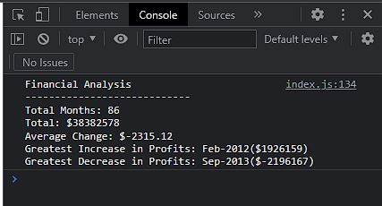

# Console-Finances

## Description

In this Bootcamp challenge, I have used JavaScript concepts learned to complete an activity; a real-world situation. I have created code for analysing the basic financial records of a company. 

The JavaScript code created analyses the financial records to calculate each of the following:

* The total number of months included in the dataset.

* The net total amount of Profit/Losses over the entire period.

* The average of the **changes** in Profit/Losses over the entire period.

* The greatest increase in profits (date and amount) over the entire period.

* The greatest decrease in profts (date and amount) over the entire period.

When the console is opened within the browser my resulting analysis is printed to the console.

## Installation
N/A

## Usage
Open index.js within this repo to view my JavaScript code. 

Open the console to see the resulting analysis:

## Credits
N/A

## License

Please refer to the LICENSE in the repo.

